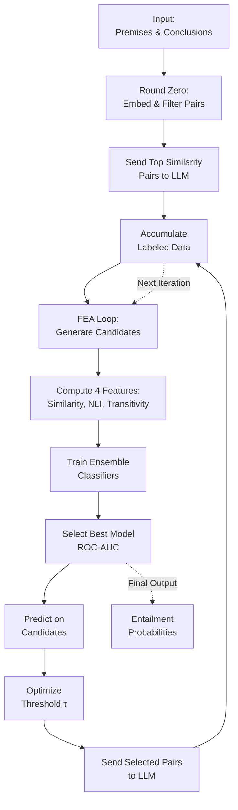

# Free Entailment Algorithm

## Overview

The **Free Entailment Algorithm (FEA)** is an iterative machine learning system that determines semantic entailment between text pairs. It combines:
- **Similarity measures** (fine-tuned bi-encoder and cross-encoder models)
- **Feature engineering** (cosine similarity, NLI scores, transitivity graphs)
- **Ensemble classifiers** (logistic regression, SVM, gradient boosting, decision trees)
- **Active learning** with LLM feedback to iteratively improve predictions

---

## Algorithm Flow



**Key Components:**
- [Round Zero](#round-zero) - Initial filtering and LLM labeling
- [FEA Loop](#fea-loop) - Iterative improvement cycle
- [Feature Engineering](#features) - Four core predictive features
- [Ensemble Classifiers](#classifiers) - Model selection and training
- [Active Learning](#active-learning) - Threshold optimization and sampling

---

## Round Zero {#round-zero}

### Purpose
Initialize a high-quality labeled dataset by sending only the most informative pairs to the LLM.

### Steps

**1. Embed All Text**
- Uses fine-tuned SBERT bi-encoder (`BAAI/bge-en-icl`)
- Generates vector embeddings for premises (p) and conclusions (sc)

**2. Generate Candidate Pairs**
- **B-B pairs:** Book-Book comparisons (p-p or sc-sc)
- **B-S pairs:** Book-Speech comparisons (p-p or sc-sc)
- Creates ~100,000 pairs of each type

**3. Calculate Similarity & Filter**
- Computes cosine similarity for all pairs
- Identifies top 1% by similarity (keeps highest-confidence pairs)
- **Rationale:** Limits LLM costs and focuses on pairs likely to be entailed
- **Example output:**
  ```
  [Premises] Scanning 45,730,266 B-B candidates
  [Premises] Found 309,794 pairs above threshold 0.7539
  [Premises] Scanning 378,648,324 B-S candidates
  [Premises] Found 1,842,492 pairs above threshold 0.7075
  Randomly sampled 50,000 B-B pairs
  Randomly sampled 50,000 B-S pairs
  ```

**4. LLM Labeling with Bidirectionality**
- Sends filtered pairs to LLM for entailment analysis
- If pair (A, B) → YES, also checks (B, A)
- If pair (A, B) → NO, automatically marks (B, A) as NO
- Saves results in batches for safety

**5. Output**
DataFrame with labeled entailment verdicts:
```
sentence_id_1 | sentence_id_2 | answers_12 | llm_conclusion_12 | verdict
B0448006p     | B1089003p     | YES, NO   | NO (inferred)     | NO
```

---

## FEA Loop {#fea-loop}

### Purpose
Orchestrate the main iterative improvement cycle.

### Key Operations

**1. Generate Valid Pairs**
- Creates new pairs from unlabeled candidates
- Supports up to ~25M pairs
- Excludes previously labeled and already-generated pairs

**2. Set Stopping Criteria**
- **Option A:** Fixed number of iterations
- **Option B:** Budget constraint
- Loop terminates when first criterion is met

**3. Pipeline Execution**
- Calls FEA Pipeline for feature computation
- Trains ensemble classifiers
- Queries LLM for high-uncertainty pairs
- Checks bidirectionality for positive results

**4. Cycle Iteration**
- Adds new LLM labels to training set
- Generates next batch of candidates
- Repeats until stopping criteria reached

---

## Feature Engineering {#features}

## Feature Engineering {#features}

The classifier uses **4 key features** to predict entailment:

### 1. Cosine Similarity (Bi-Encoder) Neighbor Score

**Source:** Fine-tuned SBERT bi-encoder

**Logic:** Weights similarity between text $A$ and the labeled equivalence class of $B$, plus similarity between $B$ and the equivalence class of $A$.

**Formula:**
$$S_{AB} = \sigma_{AB} \left[ \frac{\alpha}{|\mathcal{I}(A)|} \sum_{k \in \mathcal{I}(A)} \sigma_{AC} + \frac{1-\alpha}{|\mathcal{I}(B)|} \sum_{k \in \mathcal{I}(B)} \sigma_{BC} \right]$$

Where:
- $\sigma_{ij}$ = cosine similarity between $i$ and $j$
- $\mathcal{I}(j) = [j]$ (equivalence class of $j$, excluding $j$ itself)
- $\alpha$ = learned weighting parameter
- If either class is empty, uses direct similarity $\sigma_{ij}$

### 2. NLI Score (Cross-Encoder)

**Model:** Cross-Encoder (`nli-deberta-v3-base`)

**Logic:** Processes pair $(A, B)$ jointly to score entailment likelihood

**Formula:** Uses same weighting formula as Feature 1 (applied to NLI model outputs)

### 3. Transitivity Score

**Method:** Builds a directed graph from labeled pairs

**Check:** Detects paths between $A$ and $B$:
- Forward: $A \to X \to B$
- Backward: $B \to Y \to A$

**Scoring:**
- **1 hop:** Score = 1.0
- **2 hops:** Score = $1.0 \times \text{decay}$
- **No path:** Score = 0.0

### 4. Additional Features

*Reserved for future work*

---

## Ensemble Classifiers {#classifiers}

### Training

The 4 features are fed into multiple classifiers:

| Classifier | Config |
|-----------|--------|
| **Logistic Regression** | Scikit-learn default |
| **Spline Regression** | Isotonic calibration |
| **Kernel SVM** | `SVC(kernel='rbf', probability=True, class_weight='balanced')` |
| **Decision Tree** | `DecisionTreeClassifier(max_depth=5, class_weight='balanced')` |
| **Gradient Boosting** | `HistGradientBoostingClassifier(max_iter=200, learning_rate=0.05, l2_reg=1.0)`<br/>Hyperparameters tuned with Optuna |

### Model Selection

1. Train all classifiers on labeled data
2. Evaluate each on held-out validation set
3. **Select the model with highest ROC-AUC** (measures discrimination ability across probability thresholds)
4. Use selected model for all subsequent predictions

### Output

Returns a **probability of entailment** for each candidate pair $(A, B)$

---

## Thresholding & Active Learning {#active-learning}

### Purpose
Identify which candidate pairs to send to LLM, balancing precision/recall and cost.

### Step 1: Find Optimal Threshold

Calculate probability threshold $\tau$ that optimizes one of:
- **Accuracy:** Overall correct predictions
- **F1 Score:** Harmonic mean of precision and recall

### Step 2: Useful Thresholds

Several thresholds are computed to address different costs:

**Minimize False Positives (F_{1/2}):**
$$F_\beta = (1 + \beta^2) \cdot \frac{\text{Precision} \times \text{Recall}}{(\beta^2 \cdot \text{Precision}) + \text{Recall}}$$

Maximizes $F_{1/2}$ to penalize false positives (auto-accepted but not actually entailed)

**Minimize False Negatives (F_2):**
- Maximizes $F_2$ to penalize false negatives
- Uses Bayes' Optimal Threshold assuming FN cost = 5× FP cost (tunable)

### Step 3: Active Learning

1. **Above threshold:** Pairs with $P(\text{entailed}) > \tau$ → **Send to LLM**
2. **Below threshold:** Pairs with $P(\text{entailed}) \leq \tau$ → **Auto-reject**
3. **Compute cost:** Estimates average LLM call cost for selected pairs
4. **Output dataset:** Formats pairs for LLM evaluation
5. **Iterate:** Returns to FEA Loop with new LLM labels

---

## Model Availability

### Why Only 2 Base Models?

Currently, the project uses two fine-tuned models:
- **Bi-Encoder:** `BAAI/bge-en-icl` (for initial similarity filtering)
- **Cross-Encoder:** `nli-deberta-v3-base` (for refined entailment scoring)

**Reasons for limited model count:**

1. **Computational Cost:** Fine-tuning transformer models requires significant GPU memory and time
   - Original training used UChicago RCC's RTX 6000 GPU (24GB VRAM)
   - Each model takes 6-12 hours to train on 450,000 labeled pairs

2. **Training Data Dependency:** Models require the same ~450,000 labeled pair dataset for fair comparison
   - Generating this dataset required extensive LLM calls (expensive)
   - Adding more models would require proportional LLM budget increases

3. **Empirical Requirements:** These two models were selected because they:
   - Provide complementary information (bi-encoder speed + cross-encoder accuracy)
   - Achieve high ROC-AUC on validation data
   - Have reasonable inference latency for large-scale predictions

4. **Resource Constraints:** Adding more models would require:
   - More GPU time for training (multiplicative cost)
   - More LLM evaluations to validate improvements
   - More storage and maintenance overhead

### To Add More Models:
- Select alternative base models from Hugging Face Hub
- Fine-tune on the existing 450,000 labeled pairs
- Evaluate ROC-AUC against held-out test set
- Add to ensemble if performance justifies computational cost
- Update this documentation

---

## Technical Setup

### Requirements

See `requirements.txt` for full dependency list. Key packages:
- `torch`, `torchvision`
- `sentence-transformers` (for SBERT models)
- `transformers` (for cross-encoders)
- `scikit-learn` (for classifiers)
- `optuna` (for hyperparameter tuning)
- `openai` (for LLM calls)
- `pandas`, `numpy`, `scipy` (data processing)
- `plotly` (visualization)

### Installation

Missing packages can be installed in a notebook cell:
```python
%pip install package_name
# Then restart the kernel
```

### Hardware Requirements

**Tested Configuration:**
```
GPU: NVIDIA Quadro RTX 6000 (24GB VRAM)
Driver: 535.216.03
CUDA: 12.2
```

**Warning:** Expect issues on GPUs with <16GB VRAM. Reduce batch sizes as needed.

---

## File Structure

- **Documentation:**
  - `README.md` - This file
  - `requirements.txt` - Python dependencies

- **Main Notebooks:**
  - `FEA_Loop.ipynb` - Orchestrates the main iterative loop
  - `FEA_Pipeline.ipynb` - Manages feature extraction and preprocessing
  - `model_trainers.ipynb` - Fine-tunes bi-encoder and cross-encoder models
  - `FreeEntailmentAlgorithm.ipynb` - Core algorithm implementation

- **Utilities:**
  - `free_entailments_algorithm_utils.py` - Helper functions for all operations
  - `llm_calls/deepseek_evaluator.py` - LLM querying module
  - `llm_calls/prompts.py` - LLM prompt templates

- **Models:**
  - `fine_tuned_bi_model/` - Fine-tuned bi-encoder checkpoint

- **Data:**
  - `labeled_pairs/` - LLM-labeled entailment pairs
  - `llm_calls/` - LLM interaction logs and evaluator code
  - `seen_pair_indices/` - Tracking completed pair indices
  - `fea_iterations/` - Iteration-specific results and statistics

---

## Workflow Summary

1. **Round Zero:** Generate and label initial pairs with LLM
2. **FEA Loop Iteration:**
   - Generate new candidate pairs
   - Compute 4 features for each candidate
   - Train ensemble classifiers
   - Select best model
   - Predict on all candidates
   - Optimize threshold
   - Send high-confidence pairs to LLM
3. **Repeat:** Add LLM labels to training set; continue with updated model
4. **Output:** Probabilities and verdicts for all evaluated pairs
